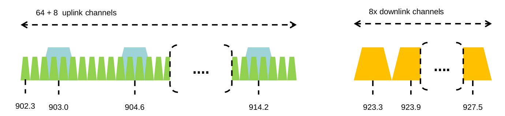
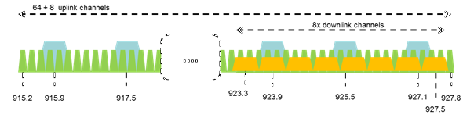
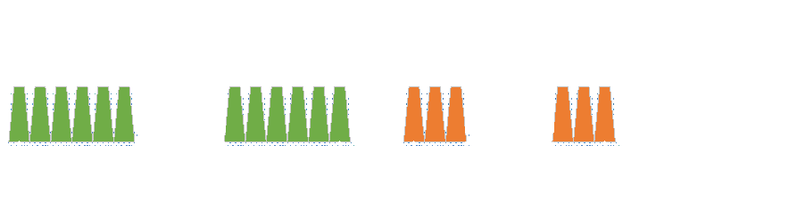

# **LoRaWAN Regional Parameters**

Copyright © (2016) LoRa Alliance, Inc. All rights reserved.

NOTICE OF USE AND DISCLOSURE
---

Copyright © LoRa Alliance, Inc. (2015). All Rights Reserved.

The information within this document is the property of the LoRa Alliance ("The Alliance") and its use and disclosure are subject to LoRa Alliance Corporate Bylaws, Intellectual Property Rights (IPR) Policy and Membership Agreements.

Elements of LoRa Alliance specifications may be subject to third party intellectual property rights, including without limitation, patent, copyright or trademark rights (such a third party may or may not be a member of LoRa Alliance). The Alliance is not responsible and shall not be held responsible in any manner for identifying or failing to identify any or all such third party intellectual property rights.

This document and the information contained herein are provided on an "AS IS" basis and THE ALLIANCE DISCLAIMS ALL WARRANTIES EXPRESS OR IMPLIED, INCLUDING BUT NOTLIMITED TO (A) ANY WARRANTY THAT THE USE OF THE INFORMATION HEREINWILL NOT INFRINGE ANY RIGHTS OF THIRD PARTIES (INCLUDING WITHOUTLIMITATION ANY INTELLECTUAL PROPERTY RIGHTS INCLUDING PATENT, COPYRIGHT OR TRADEMARK RIGHTS) OR (B) ANY IMPLIED WARRANTIES OF MERCHANTABILITY, FITNESS FOR A PARTICULAR PURPOSE,TITLE OR NONINFRINGEMENT.

IN NO EVENT WILL THE ALLIANCE BE LIABLE FOR ANY LOSS OF PROFITS, LOSS OF BUSINESS, LOSS OF USE OF DATA, INTERRUPTION OFBUSINESS, OR FOR ANY OTHER DIRECT, INDIRECT, SPECIAL OR EXEMPLARY, INCIDENTIAL, PUNITIVE OR CONSEQUENTIAL DAMAGES OF ANY KIND, IN CONTRACT OR IN TORT, IN CONNECTION WITH THIS DOCUMENT OR THE INFORMATION CONTAINED HEREIN, EVEN IF ADVISED OF THE POSSIBILITY OF SUCH LOSS OR DAMAGE.

The above notice and this paragraph must be included on all copies of this document that are made.

LoRa Alliance, Inc.  
2400 Camino Ramon, Suite 375  
San Ramon, CA 94583

*Note: All Company, brand and product names may be trademarks that are the sole property of their respective owners.*

The authors reserve the right to change

LoRaWAN™ Regional Parameters

This document is a companion document to the LoRaWAN1.0.2 Specification

**Authors**:  
LoRa Alliance Technical committee

**Version**: V1.0  
**Date**: 2016 July  
**Status:** Final

> **Important note:** This is a candidate specification for the LoRa™ Alliance protocol named LoRaWAN™.

## 1 Introduction

This document describes the LoRaWAN™ regional parameters for different regulatory regions worldwide. This document is a companion document to the protocol specification document, LoRaWAN Specification [LORAWAN], starting with version 1.0.2 of the specification. Separating the regional parameters from the protocol specification allows the addition of new regions to the former without impacting the latter document.

## 2 LoRaWAN Regional Parameters

### 2.1 EU 863-870MHz ISM Band

#### 2.1.1 EU863-870 Preamble Format

The following synchronization words should be used:

|**Modulation LORA**|**Sync word**|**Preamble length**|
|---|---|---|
|**LORA**|0x34|8 symbols|
|**GFSK**|0xC194C1|5 bytes|

**Table 1: EU863-870 synch words**

#### 2.1.2 EU863-870 ISM Band channel frequencies

This section applies to any region where the ISM radio spectrum use is defined by the ETSI \[EN300.220\] standard.

The network channels can be freely attributed by the network operator. However the three  following default channels must be implemented in every EU868MHz end-device. Those  channels are the minimum set that all network gateways should always be listening on.

|**Modulation**|**Bandwidth [kHz]**|**Channel Frequency [MHz]**|**FSK Bitrate or LoRa DR / Bitrate**|**Nb Channels**|**Duty cycle**|
|---|---|---|---|---|---|
|LoRa|125|868.10 868.30 868.50 |DR0 to DR5 / 0.3-5 kbps|3|<1%|

**Table 2: EU863-870 default channels**

In order to access the physical medium the ETSI regulations impose some restrictions such  maximum time the transmitter can be on or the maximum time a transmitter can transmit per hour. The ETSI regulations allow the choice of using either a duty-cycle limitation or a so-called **Listen Before Talk Adaptive Frequency  gility** (LBT AFA) transmissions  management. The current LoRaWAN specification exclusively uses duty-cycled limited  transmissions to comply with the ETSI regulations.

EU868MHz ISM band end-devices should use the following default parameters

- Default ERP: 14 dBm

EU868Mhz end-devices should be capable of operating in the 863 to 870 MHz frequency band and should feature a channel data structure to store the parameters of at least 16 channels. A channel data structure corresponds to a frequency and a set of data rates usable on this frequency.

The first three channels correspond to 868.1, 868.3, and 868.5 MHz / DR0 to DR5 and must be implemented in every end-device. Those default channels cannot be modified through the ***NewChannelReq*** command and guarantee a minimal common channel set between end-devices and network gateways.

The following table gives the list of frequencies that should be used by end-devices to broadcast the JoinReq message. The JoinReq message transmit duty-cycle shall follow the rules described in chapter "Retransmissions back-off" of the LoRaWAN specification document.

|**Modulation**|**Bandwidth [kHz]**|**Channel Frequency [MHz]**|**FSK Bitrate or LoRa DR / Bitrate**|**Nb Channels**|**Duty cycle**|
|---|---|---|---|---|---|
|LoRa|125|868.10 868.30 868.50 |DR0 to DR5 / 0.3-5 kbps|6|<0.1%|

**Table 3: EU863-870 JoinReq Channel List**

#### 2.1.3 EU863-870 Data Rate and End-point Output Power encoding

There is no dwell time limitation for the EU863-870 PHY layer. The TxParamSetupReq MAC command does not have to be implemented by EU863-870 devices.

The following encoding is used for Data Rate (DR) and End-point Output Power (TXPower) in the EU863-870 band:

|**DataRate**|**Configuration**|**Indicative physical bit rate [bit/s]**|
|---|---|---|
|0|LoRa: SF12 / 125kHz|250|
|1|LoRa: SF11 / 125kHz|440|
|2|LoRa: SF10 / 125kHz|980|
|3|LoRa: SF9 / 125kHz|1760|
|4|LoRa: SF8 / 125kHz|3125|
|5|LoRa: SF7 / 125kHz|5470|
|6|LoRa: SF7 / 250kHz|10000|
|7|LoRa: FSK: 50 kbps|50000|
|8..15|RFU|
**Table 4: TX data rate table**

|**TXPower**|**Configuration (ERP)**|
|---|---|
|0|20 dBm (if supported)|
|1|14dBm|
|2|11dBm|
|3|8dBm|
|4|5dBm|
|5|2dBm|
|6..15|RFU|
**Table 5: TX power table**

#### 2.1.4 EU863-870 JoinAccept CFList

The EU 863-870 ISM band LoRaWAN implements an optional **channel frequency list** (CFlist) of 16 octets in the JoinAccept message.

In this case the CFList is a list of five channel frequencies for the channels four to eight  whereby each frequency is encoded as a 24 bits unsigned integer (three octets). All these  channels are usable for DR0 to DR5 125kHz LoRa modulation. The list of frequencies is followed by a single RFU octet for a total of 16 octets.

|**Size (bytes)**|3|3|3|3|3|1|
|---|---|---|---|---|---|---|
|**CFList**|Freq Ch4|Freq Ch5|Freq Ch6|Freq Ch7|Freq Ch8|RFU|

The actual channel frequency in Hz is 100 x frequency whereby values representing  frequencies below 100 Mhz are reserved for future use. This allows setting the frequency of  a channel anywhere between 100 MHz to 1.67 GHz in 100 Hz steps. Unused channels have

a frequency value of 0. The **CFList** is optional and its presence can be detected by the length of the join-accept message. If present, the **CFList** replaces all the previous channels  stored in the end-device apart from the three default channels as defined in Chapter ERROR. The  newly defined channels are immediately enabled and usable by the end-device for  communication.

#### 2.1.5 EU863-870 LinkAdrReq command

The EU863-870 LoRaWAN only supports a maximum of 16 channels. When **ChMaskCntl**  field is 0 the ChMask field individually enables/disables each of the 16 channels.

|**ChMaskCntl**|**ChMask applies to**|
|---|---|
|0|Channels 1 to 16|
|1|RFU|
|..|..|
|4|RFU|
|5|RFU|
|6|All channels ON The device should enable all currently defined channels independently of the ChMask field value.|
|7|RFU|

**Table 6: ChMaskCntl value table**

If the ChMaskCntl field value is one of values meaning RFU, the end-device should reject the  command and unset the "**Channel mask ACK**" bit in its response.

#### 2.1.6 EU863-870 Maximum payload size

The maximum **MACPayload** size length (*M)* is given by the following table. It is derived from  limitation of the PHY layer depending on the effective modulation rate used taking into  account a possible repeater encapsulation layer. The maximum application payload length in  the absence of the optional **FOpt** control field (*N*) is also given for information only. The  value of N might be smaller if the **FOpt** field is not empty:

|**DataRate**|***M***|***N***|
|---|---|---|
|0|59|51|
|1|59|51|
|2|59|51|
|3|123|115|
|4|230|222|
|5|230|222  |
|6|230|222  |
|7|230|222  |
|8:15|Not defined|Not defined|
**Table 7: EU863-870 maximum payload size**

If the end-device will never operate with a repeater then the maximum application payload  length in the absence of the optional **FOpt** control field should be:

|**DataRate**|**M**|**N**|
|---|---|---|
|0|59|51|
|1|59|51|
|2|59|51|
|3|123|115|
|4|250|242|
|5|250|242|
|6|250|242|
|7|250|242|
|8:15|Not defined|Not defined|

**Table 8 : EU863-870 maximum payload size (not repeater compatible)**

#### 2.1.7 EU863-870 Receive windows

The RX1 receive window uses the same channel than the preceding uplink. The data rate is  a function of the uplink data rate and the RX1DROffset as given by the following table. The allowed values for RX1DROffset are in the \[0:5\] range. Values in the\[6:7\] range are 10 reserved for future use.

|**RX1DROffset**|**0**|**1**|**2**|**3**|**4**|**5**|
|---|---|---|---|---|---|---|
|**Upstream data rate**|**Downstream data rate in RX1 slot**|**Downstream data rate in RX1 slot**|**Downstream data rate in RX1 slot**|**Downstream data rate in RX1 slot**|**Downstream data rate in RX1 slot**|**Downstream data rate in RX1 slot**|
|DR0|DR0|DR0|DR0|DR0|DR0|DR0|
|DR1|DR1|DR0|DR0|DR0|DR0|DR0|
|DR2|DR2|DR1|DR0|DR0|DR0|DR0|
|DR3|DR3|DR2|DR1|DR0|DR0|DR0|
|DR4|DR4|DR3|DR2|DR1|DR0|DR0|
|DR5|DR5|DR4|DR3|DR2|DR1|DR0|
|DR6|DR6|DR5|DR4|DR3|DR2|DR1|
|DR7|DR7|DR6|DR5|DR4|DR3|DR2|

The RX2 receive window uses a fixed frequency and data rate. The default parameters are 869.525 MHz / DR0 (SF12, 125 kHz)

#### 2.1.8 EU863-870 Default Settings

The following parameters are recommended values for the EU863-870Mhz band.

|Variable name|Variable value|
|---|---|
|RECEIVE\_DELAY1|1s|
|RECEIVE\_DELAY2|2s (must be RECEIVE\_DELAY1 + 1s)|
|JOIN\_ACCEPT\_DELAY1|5s|
|JOIN\_ACCEPT\_DELAY2|6s|
|MAX\_FCNT\_GAP|16384|
|ADR\_ACK\_LIMIT|64|
|ADR\_ACK\_DELAY|32|
|ACK\_TIMEOUT|2 +/- 1 s (random delay between 1 and 3 seconds)|

If the actual parameter values implemented in the end-device are different from those default values (for example the end-device uses a longer RECEIVE\_DELAY1 and RECEIVE\_DELAY2 latency), those parameters must be communicated to the network server using an out-of-band channel during the end-device commissioning process. The network server may not accept parameters different from those default values.

### 2.2 US 902-928MHz ISM Band

#### 2.2.1 US902-928 Preamble Format

The following synchronization words should be used:

|**Modulation**|**Sync word**|**Preamble length**|
|---|---|---|
|LORA|0x34|8 symbols|

LoRaWAN does not make use of GFSK modulation in the US902-928 ISM band.

#### 2.2.2 US902-928 Channel Frequencies

The 915 MHz ISM Band shall be divided into the following channel plans.

- Upstream -- 64 channels numbered 0 to 63 utilizing LoRa 125 kHz BW varying from DR0 toDR3 starting at 902.3 MHz and incrementing linearly by 200 kHz to 914.9 MHz

- Upstream -- 8 channels numbered 64 to 71 utilizing LoRa 500 kHz BW at DR4 starting at 903.0 MHz and incrementing linearly by 1.6 MHz to 914.2 MHz

- Downstream -- 8 channels numbered 0 to 7 utilizing LoRa 500 kHz BW at DR10 to DR13) starting at 923.3 MHz and incrementing linearly by 600 kHz to 927.5 MHz

**Figure 1: US902-928 channel frequencies**

915 MHz ISM band end-devices should use the following default parameters:

- Default radiated transmit output power: 20 dBm
  - Devices, when transmitting with 125 kHz BW may use a maximum of +30 dBm. The transmission should never last more than 400 ms.|
  - Devices, when transmitting with 500 kHz BW may use a maximum of +26 dBm|

US902-928 end-devices should be capable of operating in the 902 to 928 MHz frequency  band and should feature a channel data structure to store the parameters of 72 channels. A  channel data structure corresponds to a frequency and a set of data rates usable on this  frequency.

If using the over-the-air activation procedure, the end-device should broadcast the JoinReq  message alternatively on a random 125 kHz channel amongst the 64 channels defined using  **DR0** and a random 500 kHz channel amongst the 8 channels defined using **DR4**. The end-device should change channel for every transmission.

Personalized devices shall have all 72 channels enabled following a reset.

#### 2.2.3 US902-928 Data Rate and End-point Output Power encoding

FCC regulation imposes a maximum dwell time of 400ms on uplinks. The ***TxParamSetupReq*** MAC command does not have to be implemented by US902-928 devices.

The following encoding is used for Data Rate (**DR**) and End-point Output Power (**TXPower**)  in the US902-928 band:

|**DataRate**|**Configuration**|**Indicative physical bit rate [bit/s]**|
|---|---|---|
|0|LoRa: SF10 / 125kHz|980|
|1|LoRa: SF9 / 125kHz|1760|
|2|LoRa: SF8 / 125kHz|3125|
|3|LoRa: SF7 / 500kHz|5470|
|4|LoRa: SF8 / 125kHz|12500|
|5:7|RFU|
|8|LoRa: SF12 / 500kHz|980|
|9|LoRa: SF11 / 500kHz|1760|
|10|LoRa: SF10 / 500kHz|3900|
|11|LoRa: SF9 / 500kHz|7000|
|12|LoRa: SF8 / 500kHz|12500|
|13|LoRa: SF7 / 500kHz|21900|
|14:15|RFU|
**Table 9 TX Data rate table**

|**TXPower**|**Configuration**|
|---|---|
|0|30 dBm - 2*TXpower|
|1|28dBm|
|2|26dBm|
|3:9|...|
|10|10dBm|
|11:16|RFU|
**Table 10: TX power table**

#### 2.2.4 US902-928 JoinAccept CFList

The US902-928 LoRaWAN does not support the use of the optional **CFlist** appended to the  JoinAccept message. If the **CFlist** is not empty it is ignored by the end-device.

#### 2.2.5 US902-928 LinkAdrReq command

For the US902-928 version the **ChMaskCntl** field of the ***LinkADRReq*** command has the  following meaning:

|**ChMaskCntl**|**ChMask applies to**|
|---|---|
|0|Channels 0 to 15|
|1|Channels 16 to 31|
|..|..|
|4|Channels 64 to 71|
|5|RFU|
|6|All 125 kHz ON ChMask applies to channels 65 to 72|
|7|All 125 kHz OFF ChMask applies to channels 65 to 72|

**Table 11: ChMaskCntl value table**

If ***ChMaskCntl*** = 6 then 125 kHz channels are enabled, if ***ChMaskCntl*** = 7 then 125 kHz channels are disabled. Simultaneously the channels 64 to 71 are set according to the ***ChMask*** bit mask. The DataRate specified in the command need not be valid for channels specified in the ChMask, as it governs the global operational state of the end-device.

**Note:** FCC regulation requires hopping over at least 50 channels when  using maximum output power. It is possible to have end-devices with less channels (at least six 125 kHz channels) when limiting the end-device transmit power to 21 dBm.

**Note**: A common network server action may be to reconfigure a device through multiple LinkAdrReq commands in a contiguous block of MAC Commands.  For example to reconfigure a device from 64 channel operation to the first 8 channels could contain two LinkAdrReq, the first (ChMaskCntl = 7) to disable all 125kHz channels and the second (ChMaskCntrl = 0) to enable a bank of 8 125kHz channels.

#### 2.2.6 US902-928 Maximum payload size

The maximum **MACPayload** size length (*M*) is given by the following table. It is derived from the maximum allowed transmission time at the PHY layer taking into account a possible  repeater encapsulation. The maximum application payload length in the absence of the  optional **FOpt** MAC control field (*N*) is also given for information only. The value of *N* might  be smaller if the **FOpt** field is not empty:

|**DataRate**|***M***|***N***|
|---|---|---|
|0|19|11|
|1|61|53|
|2|133|125|
|3|250|242|
|4|250|242|
|5:7|Not defined|Not defined|
|8|41|33|
|9|117|109|
|10|230|222|
|11|230|222|
|12|230|222|
|13|230|222|
|14:15|Not defined|Not defined|

**Table 12: US902-928 maximum payload size (repeater compatible)**

The greyed lines correspond to the data rates that may be used by an end-device behind a  repeater.

If the end-device will never operate under a repeater then the maximum application payload  length in the absence of the optional **FOpt** control field should be:

|**DataRate**|***M***|***N***|
|---|---|---|
|0|19|11|
|1|61|53|
|2|133|125|
|3|250|242|
|4|250|242|
|5:7|Not defined|Not defined|
|8|61|53|
|9|137|129|
|10|250|242|
|11|250|242|
|12|250|242|
|13|250|242|
|14:15|Not defined|Not defined|

**Table 13 : US902-928 maximum payload size (not repeater compatible)**

#### 2.2.7 US902-928 Receive windows

- The RX1 receive channel is a function of the upstream channel used to initiate the data exchange. The RX1 receive channel can be    determined as follows.
  - RX1 Channel Number = Transmit Channel Number modulo 8|
- The RX1 window data rate depends on the transmit data rate (see    Table 24 below).
- The RX2 (second receive window) settings uses a fixed data rate and    frequency. Default parameters are 923.3Mhz / DR8

|**Upstream data rate**|**Downstream data rate**|**Downstream data rate**|**Downstream data rate**|**Downstream data rate**|
|---|---|---|---|---|
|**RX1DROffset**|**0**|**1**|**2**|**3**|
|DR0|DR10|DR9|DR8|DR8|
|DR1|DR11|DR10|DR9|DR8|
|DR2|DR12|DR11|DR10|DR9|
|DR3|DR13|DR12|DR11|DR10|
|DR4|DR13|DR13|DR12|DR11|
|DR8|DR8|DR8|DR8|DR8|
|DR9|DR9|DR8|DR8|DR8|
|DR10|DR10|DR9|DR8|DR8|
|DR11|DR11|DR10|DR9|DR8|
|DR12|DR12|DR11|DR10|DR9|
|DR13|DR13|DR12|DR11|DR10|

**Table 14: Data rate mapping**

The allowed values for RX1DROffset are in the \[0:3\] range. Values in the range \[4:7\] are reserved for future use.

#### 2.2.8 US902-928 Default Settings

The following parameters are recommended values for the US902-928 band.

|Variable name|Variable value|
|---|---|
|RECEIVE\_DELAY1|1s|
|RECEIVE\_DELAY2|2s (must be RECEIVE\_DELAY1 + 1s)|
|JOIN\_ACCEPT\_DELAY1|5s|
|JOIN\_ACCEPT\_DELAY2|6s|
|MAX\_FCNT\_GAP|16384|
|ADR\_ACK\_LIMIT|64|
|ADR\_ACK\_DELAY|32|
|ACK\_TIMEOUT|2 +/- 1s (random delay between 1 and 3 seconds)|

If the actual parameter values implemented in the end-device are different from those default values (for example the end-device uses a longer RECEIVE\_DELAY1 & 2 latency), those parameters must be communicated to the network server using an out-of-band channel during the end-device commissioning process. The network server may not accept parameters different from those default values.

### 2.3 China 779-787MHz ISM Band

#### 2.3.1 CN779-787 Preamble Format

The following synchronization words should be used :

|**Modulation LORA**|**Sync word**|**Preamble length**|
|---|---|---|
|**LORA**|0x34|8 symbols|
|**GFSK**|0xC194C1|5 bytes|

**Table 15: CN779-787 synch words**

##### 2.3.2 CN779-787 ISM Band channel frequencies

The LoRaWAN can be used in the Chinese 779-787MHz band as long as the radio device ERP is less than 10mW (or 10dBm).

The end-device transmit duty-cycle should be lower than 1%.

The LoRaWAN channels center frequency can be in the following range:

- Minimum frequency : 779.5Mhz
- Maximum frequency : 786.5 MHz

CN780Mhz end-devices should be capable of operating in the 779 to 787 MHz frequency band and should feature a channel data structure to store the parameters of at least 16 channels. A channel data structure corresponds to a frequency and a set of data rates usable on this frequency.

The first three channels correspond to 779.5, 779.7 and 779.9 MHz with DR0 to DR5 and must be implemented in every end-device. Those default channels cannot be modified through the ***NewChannelReq*** command and guarantee a minimal common channel set between end-devices and gateways of all networks. Other channels can be freely distributed across the allowed frequency range on a network per network basis.

The following table gives the list of frequencies that should be used by end-devices to broadcast the JoinReq message. The JoinReq message transmit duty-cycle shall follow the rules described in "Retransmissions back-off" of the LoRaWAN specification document.

|**Modulation**|**Bandwidth [kHz]**|**Channel Frequency [MHz]**|**FSK Bitrate or LoRa DR / Bitrate**|**Nb Channels**|**Duty cycle**|
|---|---|---|---|---|---|
|LoRa|125|779.5 779.7 779.9 780.5 780.7 780.9 |DR0 to DR5 / 0.3-5 kbps|6|<0.1%|

**Table 16: CN780 JoinReq Channel List**

#### 2.3.3 CN779-787 Data Rate and End-device Output Power encoding

There is no dwell time limitation for the CN779-787 PHY layer. The ***TxParamSetupReq*** MAC command does not have to be implemented by CN779-787 devices.

The following encoding is used for Data Rate (DR) and End-device Output Power (TXPower)  in the CN780 band:

|**DataRate**|**Configuration**|**Indicative physical bit rate [bit/s]**|
|---|---|---|
|0|LoRa: SF12 / 125kHz|250|
|1|LoRa: SF11 / 125kHz|440|
|2|LoRa: SF10 / 125kHz|980|
|3|LoRa: SF9 / 125kHz|1760|
|4|LoRa: SF8 / 125kHz|3125|
|5|LoRa: SF7 / 125kHz|5470|
|6|LoRa: SF7 / 250kHz|10000|
|7|LoRa: FSK: 50 kbps|50000|
|8..15|RFU|

|**TXPower**|**Configuration**|
|---|---|
|0|10 dBm|
|1|7 dBm|
|2|4 dBm|
|3|1 dBm|
|4|-2 dBm|
|5|-5 dBm|
|6..15|RFU|

**Table 17: Data rate and TX power table**

#### 2.3.4 CN779-787 JoinAccept CFList

The CN780 ISM band LoRaWAN implements an optional **channel frequency list** (CFlist) of  16 octets in the JoinAccept message. In this case the CFList is a list of five channel frequencies for the channels four to eight whereby each frequency is encoded as a 24 bits unsigned integer (three octets). All these  channels are usable for DR0 to DR5 125kHz LoRa modulation. The list of frequencies is followed by a single RFU octet for a total of 16 octets.

|**Size (bytes)**|3|3|3|3|3|1|
|---|---|---|---|---|---|---|
|**CFList**|Freq Ch4|Freq Ch5|Freq Ch6|Freq Ch7|Freq Ch8|RFU|

The actual channel frequency in Hz is 100 x frequency whereby values representing frequencies below 100 Mhz are reserved for future use. This allows setting the frequency of a channel anywhere between 100 MHz to 1.67 GHz in 100 Hz steps. Unused channels have a frequency value of 0. The **CFList** is optional and its presence can be detected by the length of the join-accept message. If present, the **CFList** replaces all the previous channels stored in the end-device apart from the three default channels as defined in Chapter 6.

The newly defined channels are immediately enabled and usable by the end-device for communication.

#### 2.3.5 CN779-787 LinkAdrReq command

The CN780 LoRaWAN only supports a maximum of 16 channels. When **ChMaskCntl** field is 0 the ChMask field individually enables/disables each of the 16 channels.

|**ChMaskCntl**|**ChMask applies to**|
|---|---|
|0|Channels 1 to 16|
|1|RFU|
|..|..|
|4|RFU|
|5|RFU|
|6|All channels ON The device should enable all currently defined channels independently of the ChMask field value.|
|7|RFU|

**Table 18: ChMaskCntl value table**

If the ChMask field value is one of values meaning RFU, then end-device should reject the command and unset the "**Channel mask ACK**" bit in its response.

#### 2.3.6 CN779-787 Maximum payload size

The maximum **MACPayload** size length (*M*) is given by the following table. It is derived from limitation of the PHY layer depending on the effective modulation rate used taking into account a possible repeater encapsulation layer. The maximum application payload length in the absence of the optional **FOpt** control field (*N*) is also given for information only. The value of *N* might be smaller if the **FOpt** field is not empty:

|**DataRate**|***M***|***N***|
|---|---|---|
|0|59|51|
|1|59|51|
|2|59|51|
|3|123|115|
|4|230|222|
|5|230|222  |
|6|250|242  |
|7|230|222  |
|8:15|Not defined|Not defined|

**Table 19: CN780 maximum payload size**

If the end-device will never operate with a repeater then the maximum application payload  length in the absence of the optional **FOpt** control field should be:

|**DataRate**|**M**|**N**|
|---|---|---|
|0|59|51|
|1|59|51|
|2|59|51|
|3|123|115|
|4|250|242|
|5|250|242|
|6|250|242|
|7|250|242|
|8:15|Not defined|Not defined|
**Table 20 : CN780 maximum payload size (not repeater compatible)**

#### 2.3.7 CN779-787 Receive windows

The RX1 receive window uses the same channel than the preceding uplink. The data rate is a function of the uplink data rate and the RX1DROffset as given by the following table. The  allowed values for RX1DROffset are in the \[0:5\] range. Values in the range \[6:7\] are  reserved for future use.

|**RX1DROffset**|**0**|**1**|**2**|**3**|**4**|**5**|
|---|---|---|---|---|---|---|
|**Upstream data rate**|**Downstream data rate in RX1 slot**|**Downstream data rate in RX1 slot**|**Downstream data rate in RX1 slot**|**Downstream data rate in RX1 slot**|**Downstream data rate in RX1 slot**|**Downstream data rate in RX1 slot**|
|DR0|DR0|DR0|DR0|DR0|DR0|DR0|
|DR1|DR1|DR0|DR0|DR0|DR0|DR0|
|DR2|DR2|DR1|DR0|DR0|DR0|DR0|
|DR3|DR3|DR2|DR1|DR0|DR0|DR0|
|DR4|DR4|DR3|DR2|DR1|DR0|DR0|
|DR5|DR5|DR4|DR3|DR2|DR1|DR0|
|DR6|DR6|DR5|DR4|DR3|DR2|DR1|
|DR7|DR7|DR6|DR5|DR4|DR3|DR2|

The RX2 receive window uses a fixed frequency and data rate. The default parameters are 786 MHz / DR0.

#### 2.3.8 CN779-787 Default Settings

The following parameters are recommended values for the CN779-787MHz band.

|Variable name|Variable value|
|---|---|
|RECEIVE\_DELAY1|1s|
|RECEIVE\_DELAY2|2s (must be RECEIVE\_DELAY1 + 1s)|
|JOIN\_ACCEPT\_DELAY1|5s|
|JOIN\_ACCEPT\_DELAY2|6s|
|MAX\_FCNT\_GAP|16384|
|ADR\_ACK\_LIMIT|64|
|ADR\_ACK\_DELAY|32|
|ACK\_TIMEOUT|2 +/- 1 s (random delay between 1 and 3 seconds)|

If the actual parameter values implemented in the end-device are different from those default values (for example the end-device uses a longer RECEIVE\_DELAY1 and ECEIVE\_DELAY2 latency), those parameters must be communicated to the network server using an out-of-band channel during the end-device commissioning process. The network server may not accept parameters different from those default values.

### 2.4 EU 433MHz ISM Band

#### 2.4.1 EU433 Preamble Format

The following synchronization words should be used :

|**Modulation LORA**|**Sync word**|**Preamble length**|
|---|---|---|
|**LORA**|0x34|8 symbols|
|**GFSK**|0xC194C1|3 bytes|

**Table 21: EU433 synch words**

#### 2.4.2 EU433 ISM Band channel frequencies

The LoRaWAN can be used in the ETSI 433-434 MHz band as long as the radio device ERP is less than 10 mW (or 10 dBm).

The end-device transmit duty-cycle should be lower than 1%[1](#fn16).

The LoRaWAN channels center frequency can be in the following range:

- Minimum frequency : 433.175 MHz
- Maximum frequency : 434.665 MHz

EU433 end-devices should be capable of operating in the 433.05 to 434.79 MHz frequency band and should feature a channel data structure to store the parameters of at least 16 channels. A channel data structure corresponds to a frequency and a set of data rates usable on this frequency.

The first three channels correspond to 433.175, 433.375 and 433.575 MHz with DR0 to DR5 and must be implemented in every end-device. Those default channels cannot be modified through the ***NewChannelReq*** command and guarantee a minimal common channel set between end-devices and gateways of all networks. Other channels can be freely distributed across the allowed frequency range on a network per network basis.

The following table gives the list of frequencies that should be used by end-devices to broadcast the JoinReq message. The JoinReq message transmit duty-cycle shall follow the rules described in "Retransmissions back-off" of the LoRaWAN specification document.

|**Modulation**|**Bandwidth [kHz]**|**Channel Frequency [MHz]**|**FSK Bitrate or LoRa DR / Bitrate**|**Nb Channels**|**Duty cycle**|
|---|---|---|---|---|---|
|LoRa|125|433.175 433.375 433.575 |DR0 to DR5 / 0.3-5 kbps|3|<1%|
**Table 22: EU433 JoinReq Channel List**

<a name="fn16">1</a>: The EN300220 ETSI standard limits to 10% the maximum transmit duty-cycle in the 433MHz ISM band. The LoRaWAN requires a 1% transmit duty-cycle lower than the legal limit to avoid network congestion.

#### 2.4.3 EU433 Data Rate and End-device Output Power encoding

There is no dwell time limitation for the EU433 PHY layer. The ***TxParamSetupReq*** MAC command does not have to be implemented by EU433 devices.

The following encoding is used for Data Rate (DR) and End-point Output Power (TXPower)  in the EU433 band:

|**DataRate**|**Configuration**|**Indicative physical bit rate [bit/s]**|
|---|---|---|
|0|LoRa: SF12 / 125kHz|250|
|1|LoRa: SF11 / 125kHz|440|
|2|LoRa: SF10 / 125kHz|980|
|3|LoRa: SF9 / 125kHz|1760|
|4|LoRa: SF8 / 125kHz|3125|
|5|LoRa: SF7 / 125kHz|5470|
|6|LoRa: SF7 / 250kHz|10000|
|7|LoRa: FSK: 50 kbps|50000|
|8..15|RFU|

|**TXPower**|**Configuration**|
|---|---|
|0|10 dBm|
|1|7 dBm|
|2|4 dBm|
|3|1 dBm|
|4|-2 dBm|
|5|-5 dBm|
|6..15|RFU|
**Table 23: Data rate and TX power table**

#### 2.4.4 EU433 JoinAccept CFList

The EU433 ISM band LoRaWAN implements an optional **channel frequency list** (CFlist) of 16 octets in the JoinAccept message.

In this case the CFList is a list of five channel frequencies for the channels four to eight  whereby each frequency is encoded as a 24 bits unsigned integer (three octets). All these  channels are usable for DR0 to DR5 125 kHz LoRa modulation. The list of frequencies is followed by a single RFU octet for a total of 16 octets.

|**Size (bytes)**|3|3|3|3|3|1|
|---|---|---|---|---|---|---|
|**CFList**|Freq Ch4|Freq Ch5|Freq Ch6|Freq Ch7|Freq Ch8|RFU|

The actual channel frequency in Hz is 100 x frequency whereby values representing frequencies below 100 Mhz are reserved for future use. This allows setting the frequency of  a channel anywhere between 100 MHz to 1.67 GHz in 100 Hz steps. Unused channels have  a frequency value of 0. The **CFList** is optional and its presence can be detected by the  length of the join-accept message. If present, the **CFList** replaces all the previous channels  stored in the end-device apart from the three default channels as defined in Chapter 6.

The newly defined channels are immediately enabled and usable by the end-device for  communication.

#### 2.4.5 EU433 LinkAdrReq command

The EU433 LoRaWAN only supports a maximum of 16 channels. When **ChMaskCntl** field is  0 the ChMask field individually enables/disables each of the 16 channels.

|**ChMaskCntl**|**ChMask applies to**|
|---|---|
|0|Channels 1 to 16|
|1|RFU|
|..|..|
|4|RFU|
|5|RFU|
|6|All channels ON The device should enable all currently defined channels independently of the ChMask field value.|
|7|RFU|

**Table 24: ChMaskCntl value table**

If the ChMask field value is one of the values meaning RFU, then end-device should reject the command and unset the "**Channel mask ACK**" bit in its response.

#### 2.4.6 EU433 Maximum payload size

The maximum **MACPayload** size length (*M*) is given by the following table. It is derived from limitation of the PHY layer depending on the effective modulation rate used taking into account a possible repeater encapsulation layer. The maximum application payload length in the absence of the optional **FOpt** control field (*N*) is also given for information only. The value of N might be smaller if the **FOpt** field is not empty:

|**DataRate**|***M***|***N***|
|---|---|---|
|0|59|51|
|1|59|51|
|2|59|51|
|3|123|115|
|4|230|222|
|5|230|222  |
|6|230|222  |
|7|230|222  |
|8:15|Not defined|Not defined|
**Table 25: EU433 maximum payload size**

If the end-device will never operate with a repeater then the maximum application payload  length in the absence of the optional **FOpt** control field should be:

|**DataRate**|**M**|**N**|
|---|---|---|
|0|59|51|
|1|59|51|
|2|59|51|
|3|123|115|
|4|250|242|
|5|250|242|
|6|250|242|
|7|250|242|
|8:15|Not defined|Not defined|

**Table 26 : EU433 maximum payload size (not repeater compatible)**

#### 2.4.7 EU433 Receive windows

The RX1 receive window uses the same channel than the preceding uplink. The data rate is a function of the uplink data rate and the RX1DROffset as given by the following table. The  allowed values for RX1DROffset are in the \[0:5\] range. Values in the range \[6:7\] are  reserved for future use.

|**RX1DROffset**|**0**|**1**|**2**|**3**|**4**|**5**|
|---|---|---|---|---|---|---|
|**Upstream data rate**|**Downstream data rate in RX1 slot**|**Downstream data rate in RX1 slot**|**Downstream data rate in RX1 slot**|**Downstream data rate in RX1 slot**|**Downstream data rate in RX1 slot**|**Downstream data rate in RX1 slot**|
|DR0|DR0|DR0|DR0|DR0|DR0|DR0|
|DR1|DR1|DR0|DR0|DR0|DR0|DR0|
|DR2|DR2|DR1|DR0|DR0|DR0|DR0|
|DR3|DR3|DR2|DR1|DR0|DR0|DR0|
|DR4|DR4|DR3|DR2|DR1|DR0|DR0|
|DR5|DR5|DR4|DR3|DR2|DR1|DR0|
|DR6|DR6|DR5|DR4|DR3|DR2|DR1|
|DR7|DR7|DR6|DR5|DR4|DR3|DR2|
**Table 27: EU43 RX1DROffset**

The RX2 receive window uses a fixed frequency and data rate. The default parameters are 434.665MHz / DR0 (SF12 , 125kHz)

#### 2.4.8 EU433 Default Settings

The following parameters are recommended values for the EU433   band.

|Variable name|Variable value|
|---|---|
|RECEIVE\_DELAY1|1s|
|RECEIVE\_DELAY2|2s (must be RECEIVE\_DELAY1 + 1s)|
|JOIN\_ACCEPT\_DELAY1|5s|
|JOIN\_ACCEPT\_DELAY2|6s|
|MAX\_FCNT\_GAP|16384|
|ADR\_ACK\_LIMIT|64|
|ADR\_ACK\_DELAY|32|
|ACK\_TIMEOUT|2 +/- 1 s (random delay between 1 and 3 seconds)|

If the actual parameter values implemented in the end-device are different from those default values (for example the end-device uses a longer RECEIVE\_DELAY1 & 2 latency) , those parameters must be communicated to the network server using an out-of-band channel during the end-device commissioning process. The network server may not accept parameters different from those default values.

### 2.5 Australia 915-928MHz ISM Band

#### 2.5.1 AU915-928 Preamble Format

The following synchronization words should be used:

|Modulation|Sync word|Preamble length|
|---|---|---|
LORA|0x34|8 symbols|

LoRaWAN does not make use of GFSK modulation in the AU915-928 ISM band.

#### 2.5.2 AU915-928 Channel Frequencies

The AU ISM Band shall be divided into the following channel plans.

- Upstream – 64 channels numbered 0 to 63 utilizing LoRa 125 kHz BW varying from DR0 to DR3, using coding rate 4/5, starting at 915.2 MHz and incrementing linearly by 200 kHz to 927.8 MHz
- Upstream – 8 channels numbered 64 to 71 utilizing LoRa 500 kHz BW at DR4 starting at 915.9 MHz and incrementing linearly by 1.6 MHz to 927.1 MHz
- Downstream – 8 channels numbered 0 to 7 utilizing LoRa 500 kHz BW at DR8 to DR13) starting at 923.3 MHz and incrementing linearly by 600 kHz to 927.5 MHz

**Figure 2: AU915-928 channel frequencies**

AU ISM band end-devices should use the following default parameters:

- Default radiated transmit output power: 20 dBm o All Devices may use a maximum of +30 dBm.  
  - Devices, when transmitting with 125 kHz BW must frequency hop using a minimum of 20 channels. . The transmission shall never last more than 400 ms.
  - Devices, when transmitting with 500 kHz BW may use a maximum of +26 dBm

AU915-928 end-devices should be capable of operating in the 915 to 928 MHz frequency band and should feature a channel data structure to store the parameters of 72 channels. A channel data structure corresponds to a frequency and a set of data rates usable on this frequency.

If using the over-the-air activation procedure, the end-device should broadcast the JoinReq message alternatively on a random 125 kHz channel amongst the 64 channels defined using **DR0** and a random 500 kHz channel amongst the 4 channels defined using **DR4**. The enddevice should change channel for every transmission.

Personalized devices shall have all 72 channels enabled following a reset.

#### 2.5.3 AU915-928 Data Rate and End-point Output Power encoding

The ***TxParamSetupReq*** MAC command does not have to be implemented by AU915-928 devices.

The following encoding is used for Data Rate (**DR**) and End-point Output Power (**TXPower**) in the AU915-928 band:

|DataRate|Configuration|Indicative physical bit rate [bit/sec]|
|---|---|---|
|0|LoRa: SF10 / 125 kHz|980|
|1|LoRa: SF9 / 125 kHz|1760|
|2|LoRa: SF8 / 125 kHz|3125|
|3|LoRa: SF7 / 125 kHz|5470|
|4|LoRa: SF8 / 500 kHz|12500|
|5:7|RFU||
|8|LoRa: SF12 / 500 kHz|980|
|9|LoRa: SF11 / 500 kHz|1760|
|10|LoRa: SF10 / 500 kHz|3900|
|11|LoRa: SF9 / 500 kHz|7000|
|12|LoRa: SF8 / 500 kHz|12500|
|13|LoRa: SF7 / 500 kHz|21900|
|14:15|RFU||

**Table 28: AU915 Data rate table**

|TXPower|Configuration|
|---|---|
|0|30 dBm - 2*TXpower|
|1|28 dBm|
|2|26 dBm|
|3 : 9|...|
|10|10 dBm|
|11:15|RFU|

**Table 29 : AU915 TX power table**

DR4 is identical to DR12, DR8...13 must be implemented in end-devices and are reserved for future applications.

#### 2.5.4 AU915-928 JoinAccept CFList

The AU915-928 LoRaWAN does not support the use of the optional CFlist appended to the JoinAccept message. If the CFlist is not empty it is ignored by the end-device.

#### 2.5.5 AU915-928 LinkAdrReq command

For the AU915-928 version the ChMaskCntl field of the LinkADRReq command has the following meaning:

|ChMaskCntl|ChMask applies to|
|---|---|
|0|Channels 0 to 15|
|1|Channels 16 to 31|
|..|..|
|4|Channels 64 to 71|
|5|RFU|
|6|All 125 kHz ON ChMask applies to channels 64 to 71|
|7|All 125 kHz OFF ChMask applies to channels 64 to 71|
**Table 30: ChMaskCntl value table**

If **ChMaskCntl** = 6 (resp 7) then 125 kHz channels are enabled (resp disabled). Simultaneously the channels 64 to 67 are set according to the **ChMask** bit mask.
> Note: ACMA regulation requires hopping over at least 20 channels when using channels that do not meet a minimum 6 dB bandwidth of 500 kHz.

#### 2.5.6 AU915-928 Maximum payload size

The maximum **MACPayload** size length (M) is given by the following table. It is derived from the maximum allowed transmission time at the PHY layer taking into account a possible repeater encapsulation. The maximum application payload length in the absence of the optional **FOpt** MAC control field (N) is also given for information only. The value of N might be smaller if the **FOpt** field is not empty:

|DataRate|M|N|
|---|---|---|
|0|19|11|
|1|61|53|
|2|134|126|
|3|250|242|
|4|250|242|
|5:7|Not defined|Not defined|
|8|41|33|
|9|117|109|
|10|230|222|
|11|230|222|
|12|230|222|
|13|230|222|
|14:15|Not defined|Not defined|

**Table 31: AU915-928 maximum payload size**

The greyed lines correspond to the data rates that may be used by an end-device behind a repeater.

If the end-device will never operate with a repeater then the maximum application payload length in the absence of the optional FOpt control field should be:

|DataRate|M|N|
|---|---|---|
|0|19|11|
|1|61|53|
|2|134|126|
|3|250|242|
|4|250|242|
|5:7|Not defined|Not defined|
|8|61|53|
|9|137|129|
|10|250|242|
|11|250|242|
|12|250|242|
|13|250|242|
|14:15|Not defined|Not defined|
**Table 32: AU915-928 maximum payload size(not repeater compatible)**

#### 2.5.7 AU915-928 Receive windows

- The RX1 receive channel is a function of the upstream channel used to initiate the data exchange. The RX1 receive channel can be determined as follows.
  - RX1 Channel Number = Transmit Channel Number modulo 8
- The RX1 window data rate depends on the transmit data rate (see Table 24 below).
- The RX2 (second receive window) settings uses a fixed data rate and frequency. Default parameters are 923.3Mhz / DR8  

|Upstream data rate|Downstream data rate|Downstream data rate|Downstream data rate|Downstream data rate|
|---|---|---|---|---|
|RX1DROffset|0|1|2|3|
|DR0|DR10|DR9|DR8|DR8|
|DR1|DR11|DR10|DR9|DR8|
|DR2|DR12|DR11|DR10|DR9|
|DR3|DR13|DR12|DR11|DR10|
|DR4|DR13|DR13|DR12|DR11|
**Table 33: AU RX1DROffset**

The allowed values for RX1DROffset are in the [0:3] range. Values in the range [4:7] are reserved for future use.

#### 2.5.8 AU915-928 Default Settings

The following parameters are recommended values for the AU915-928 band.
|Variable name|Variable value|
|---|---|
|RECEIVE_DELAY1|1 s|
|RECEIVE_DELAY2|2 s (must be RECEIVE_DELAY1 + 1s)|
|JOIN_ACCEPT_DELAY1|5 s|
|JOIN_ACCEPT_DELAY2|6 s|
|MAX_FCNT_GAP|16384|
|ADR_ACK_LIMIT|64|
|ADR_ACK_DELAY|32|
|ACK_TIMEOUT|2 +/- 1 s (random delay between 1 and 3 seconds)|

If the actual parameter values implemented in the end-device are different from those default values (for example the end-device uses a longer RECEIVE_DELAY1 & 2 latency), those parameters must be communicated to the network server using an out-of-band channel during the end-device commissioning process. The network server may not accept parameters different from those default values.

### 2.6 CN 470-510MHz Band

#### 2.6.1 CN470-510 Preamble Format

The following synchronization words should be used:

|Modulation|Sync word|Preamble length|
|---|---|---|
LORA|0x34|8 symbols|

#### 2.6.2 CN470-510 Channel Frequencies

In China, this band is defined by SRRC to be used for civil metering applications.

The 470 MHz ISM Band shall be divided into the following channel plans:

- Upstream – 96 channels numbered 0 to 95 utilizing LoRa 125 kHz BW varying fromDR0 to DR5, using coding rate 4/5, starting at 470.3 MHz and incrementing linearly by 200 kHz to 489.3 MHz

> Channel Index 6 to 38 and 45 to 77 are mainly used by China Electric Power. In the areas where these channels are used by China Electric Power, they should be disabled.

- Downstream – 48 channels numbered 0 to 47 utilizing LoRa 125 kHz BW varying from DR0 to DR5, using coding rate 4/5, starting at 500.3 MHz and incrementing linearly by 200 kHz to 509.7 MHz

**Figure 3: CN470-510 channel frequencies**

AU ISM band end-devices should use the following default parameters:

The LoRaWAN can be used in the Chinese 470-510MHz band as long as

- The radio device EIRP is less than 50mW (or 17dBm).
- The transmission never lasts more than 5000 ms.

CN470 MHz band end-devices should use the following default parameters:

- Default radiated transmits output power: 14 dBm.

CN470-510 end-devices should be capable of operating in the 470 to 510 MHz frequency band and should feature a channel data structure to store the parameters of 96 uplink channels. A channel data structure corresponds to a frequency and a set of data rates usable on this frequency.

If using the over-the-air activation procedure, the end-device should broadcast the JoinReq message on a random 125 kHz channel amongst the 96 uplink channels defined using **DR5 to DR0**.  
Personalized devices shall have all 96 channels enabled following a reset.

#### 2.6.3 CN470-510 Data Rate and End-point Output Power encoding

There is no dwell time limitation for the CN470-510 PHY layer. The ***TxParamSetupReq*** MAC command does not have to be implemented by CN470-510 devices.

The following encoding is used for Data Rate (**DR**) and End-point Output Power (**TXPower**) in the Cn470-510 band:

|DataRate|Configuration|Indicative physical bit rate [bit/sec]|
|---|---|---|
|0|LoRa: SF12 / 125 kHz|250|
|1|LoRa: SF11 / 125 kHz|440|
|2|LoRa: SF10 / 125 kHz|980|
|3|LoRa: SF9 / 125 kHz|1760|
|4|LoRa: SF8 / 125 kHz|3125|
|5|LoRa: SF7 / 125 kHz|5470|
|6:15|RFU||

**Table 34: CN470 Data rate table**

|TXPower|Configuration|
|---|---|
|0|17 dBm|
|1|16 dBm|
|2|14 dBm|
|3|12 dBm|
|4|10 dBm|
|5|7 dBm|
|6|5 dBm|
|7|2 dBm|
|8...15|RFU|

**Table 34 : CN470 TX power table**

DR4 is identical to DR12, DR8...13 must be implemented in end-devices and are reserved for future applications.

#### 2.6.4 CN470-510 JoinResp CFList

The CN470-510 LoRaWAN does not support the use of the optional **CFlist** appended to the 13 JoinAccept message. If the CFlist is not empty it is ignored by the end-device.

#### 2.6.5 CN470-510 LinkAdrReq command

For the CN470-510 version the ChMaskCntl field of the LinkADRReq command has the following meaning:

|ChMaskCntl|ChMask applies to|
|---|---|
|0|Channels 0 to 15|
|1|Channels 16 to 31|
|2|Channels 32 to 47|
|3|Channels 48 to 63|
|4|Channels 64 to 79|
|5|Channels 80 to 95|
|6|All channels ON The device should enable all currently defined channels independently of the ChMask field value.|
|7|RFU|

**Table 35: CN470 ChMaskCntl value table**

If the ChMask field value is one of the values meaning RFU, then end-device should reject the command and unset the **Channel mask ACK** bit in its response.

#### 2.6.6 CN470-510 Maximum payload size

The maximum **MACPayload** size length (M) is given by the following table. It is derived from the maximum allowed transmission time at the PHY layer taking into account a possible repeater encapsulation. The maximum application payload length in the absence of the optional **FOpt** MAC control field (N) is also given for information only. The value of N might be smaller if the **FOpt** field is not empty:

|DataRate|M|N|
|---|---|---|
|0|59|51|
|1|59|51|
|2|59|51|
|3|123|115|
|4|230|222|
|5|230|222|
|6:15|Not defined|Not defined|

**Table 36: CN470-510 maximum payload size**

#### 2.6.7 CN470-510 Receive windows

- The RX1 receive channel is a function of the upstream channel used to initiate the data exchange. The RX1 receive channel can be determined as follows.
  - RX1 Channel Number = Uplink Channel Number modulo 48, for example, when transmitting channel number is 49, the rx1 channel number is 1.
- The RX1 window data rate depends on the transmit data rate (see Table Table 37: CN470-510 Data rate offset below).
- The RX2 (second receive window) settings uses a fixed data rate and frequency. Default parameters are 505.3 MHz / DR0

|Upstream data rate|Downstream data rate in RX1 slot|Downstream data rate in RX1 slot|Downstream data rate in RX1 slot|Downstream data rate in RX1 slot|Downstream data rate in RX1 slot|Downstream data rate in RX1 slot|
|---|---|---|---|---|---|---|
|RX1DROffset|0|1|2|3||4|5
|DR0|DR0|DR0|DR0|DR0|DR0|DR0|
|DR1|DR1|DR0|DR0|DR0|DR0|DR0|
|DR2|DR2|DR1|DR0|DR0|DR0|DR0|
|DR3|DR3|DR2|DR1|DR0|DR0|DR0|
|DR4|DR4|DR3|DR2|DR1|DR0|DR0|
|DR5|DR5|DR4|DR3|DR2|DR1|DR0|
**Table 37: CN470-510 Data rate offset**

The allowed values for RX1DROffset are in the [0:3] range. Values in the range [4:7] are reserved for future use.

#### 2.6.8 CN470-510 Default Settings

The following parameters are recommended values for the CN470-510 band.
|Variable name|Variable value|
|---|---|
|RECEIVE_DELAY1|1 s|
|RECEIVE_DELAY2|2 s (must be RECEIVE_DELAY1 + 1s)|
|JOIN_ACCEPT_DELAY1|5 s|
|JOIN_ACCEPT_DELAY2|6 s|
|MAX_FCNT_GAP|16384|
|ADR_ACK_LIMIT|64|
|ADR_ACK_DELAY|32|
|ACK_TIMEOUT|2 +/- 1 s (random delay between 1 and 3 seconds)|

If the actual parameter values implemented in the end-device are different from those default values (for example the end-device uses a longer RECEIVE_DELAY1 & 2 latency), those parameters must be communicated to the network server using an out-of-band channel during the end-device commissioning process. The network server may not accept parameters different from those default values.

### 2.7 AS923MHz ISM Band

#### 2.7.1 AS923 Preamble Format

The following synchronization words should be used:

|Modulation|Sync word|Preamble length|
|---|---|---|
|LORA|0x34|8 symbols|
|GFSK|0xC194C1|5 bytes|

**Table 38: AS923 synch words**

#### 2.7.2 AS923 ISM Band channel frequencies

This section applies to regions where the frequencies [923…923.5MHz] are comprised in the ISM band, which is the case for the following countries:

- Brunei [923-925 MHz]
- Cambodia [923-925 MHz]
- Hong Kong [920-925 MHz]
- Indonesia [923-925 MHz]
- Japan [920-928 MHz]
- Laos [923-925 MHz]
- New Zealand [915-928 MHz]
- Singapore [920-925 MHz]
- Taiwan [922-928 MHz]
- Thailand [920-925 MHz]
- Vietnam [920-925 MHz]

The network channels can be freely attributed by the network operator. However the two following default channels must be implemented in every AS923MHz end-device. Those channels are the minimum set that all network gateways should always be listening on.

|Modulation|Bandwidth [kHz]|Channel Frequency [MHz]|FSK Bitrate or LoRa DR / Bitrate|Nb Channels|Duty cycle|
|---|---|---|---|---|---|
|LoRa|125|923.20 923.40|DR0 to DR5  / 0.3-5 kbps|2|< 1%|
**Table 39: AS923 default channels**

Those default channels must be implemented in every end-device and cannot be modified through the NewChannelReq command and guarantee a minimal common channel set between end-devices and network gateways.

AS923MHz ISM band end-devices should use the following default parameters

- Default ERP: 14 dBm

AS923MHz end-devices should feature a channel data structure to store the parameters of at least 16 channels. A channel data structure corresponds to a frequency and a set of data rates usable on this frequency.

The following table gives the list of frequencies that should be used by end-devices to broadcast the JoinReq message.

|Modulation|Bandwidth [kHz]|Channel Frequency [MHz]|FSK Bitrate or LoRa DR / Bitrate|Nb Channels|Duty cycle|
|---|---|---|---|---|---|
|LoRa|125|923.2 923.40|DR2|2|< 1%|
**Table 40: AS923 JoinReq Channel List**

The default JoinReq Data Rate is DR2 (SF10/125KHz), this setting ensures that end-devices are compatible with the 400ms dwell time limitation until the actual dwell time limit is notified to the end-device by the network server via the MAC command "TxParamSetupReq". The JoinReq message transmit duty-cycle shall follow the rules described in chapter "Retransmissions back-off" of the LoRaWAN specification document.

#### 2.7.3 AS923 Data Rate and End-point Output Power encoding

The following encoding is used for Data Rate (DR) in the AS923 band:

|DataRate|Configuration|Indicative physical bit rate [bit/s]|
|---|---|---|
|0|LoRa: SF12 / 125 kHz|250|
|1|LoRa: SF11 / 125 kHz|440|
|2|LoRa: SF10 / 125 kHz|980|
|3|LoRa: SF9 / 125 kHz|1760|
|4|LoRa: SF8 / 125 kHz|3125|
|5|LoRa: SF7 / 125 kHz|5470|
|6|LoRa: SF7 / 250 kHz|11000|
|7|FSK: 50 kbps|50000|
|8..15|RFU|
**Table 41: Data rate table**

The TXPower table indicates power levels relative to the Max ERP level of the end-device, as per the following table:

|TXPower|Configuration|
|---|---|
|0|Max ERP|
|1|Max ERP – 2dB|
|2|Max ERP – 4dB|
|3|Max ERP – 6dB|
|4|Max ERP – 8dB|
|5|Max ERP – 10dB|
|6..15|RFU|
**Table 42: TxPower table**

#### 2.7.4 AS923 JoinAccept CFList

The AS923 LoRaWAN implements an optional channel frequency list (CFlist) of 16 octets in the JoinAccept message.

In this case the CFList is a list of five channel frequencies for the channels three to seven whereby each frequency is encoded as a 24 bits unsigned integer (three octets). All these channels are usable for DR0 to DR5 125 KHz LoRa modulation.  

|Size (bytes)||3|3|3|3|3|1
|---|---|---|---|---|---|---|---|
CFList|Freq Ch3|Freq Ch4|Freq Ch5|Freq Ch6|Freq Ch7|RFU|

The actual channel frequency in Hz is 100 x frequency whereby values representing frequencies below 100 MHz are reserved for future use. This allows setting the frequency of a channel anywhere between 915 and 928MHz in 100 Hz steps. Unused channels have a frequency value of 0. The CFList is optional and its presence can be detected by the length of the join-accept message. If present, the CFList replaces all the previous channels stored in the end-device apart from the two default channels as defined in Chapter 1.7.2. The newly defined channels are immediately enabled and usable by the end-device for communication.

#### 2.7.5 AS923 LinkAdrReq command

The AS923 LoRaWAN only supports a maximum of 16 channels. When ChMaskCntl field is 0 the ChMask field individually enables/disables each of the 16 channels.

|ChMaskCntl|ChMask applies to|
|---|---|
|0|Channels 1 to 16|
|1|RFU|
|..|..|
|4|RFU|
|5|RFU|
|6|All channels ON The device should enable all currently defined channels independently of the ChMask field value.|
|7|RFU|

**Table 43: ChMaskCntl value table**
If the ChMask field value is one of values meaning RFU, the end-device should reject the command and unset the “Channel mask ACK” bit in its response.

#### 2.7.6 AS923 Maximum payload size

The maximum MACPayload size length *(M)* is given by the following table for both dwell time configurations: No Limit and 400ms. It is derived from the PHY layer limitation depending on the effective modulation rate used taking into account a possible repeater encapsulation layer.

|DataRate|Uplink MAC Payload Size (M)|Uplink MAC Payload Size (M)|Downlink MAC Payload Size (M)|Downlink MAC Payload Size (M)|
|---|---|---|---|---|
||UplinkDwellTime = 0|UplinkDwellTime   = 1|DownlinkDwellTime = 0|DownlinkDwellTime  = 1|
|0|59|N/A|59|N/A|
|1|59|N/A|59|N/A|
|2|59|19|59|19|
|3|123|61|123|61|
|4||230|133|230|134|
|5|230|250|230|250|
|6|230|250|230|250|
|7|230|250|230|250|
|8:15|RFU|RFU|

**Table 44: AS923 maximum payload size**

If the end-device will never operate with a repeater then the maximum MAC payload length should be:

|DataRate|Uplink MAC Payload Size (M)|Uplink MAC Payload Size (M)|Downlink MAC Payload Size (M)|Downlink MAC Payload Size (M)|
|---|---|---|---|---|
||UplinkDwellTime = 0|UplinkDwellTime = 1|DownlinkDwellTime = 0|DownlinkDwellTim e  = 1|
|0|59|N/A|59|N/A|
|1|59|N/A|59|N/A|
|2|59|19|59|19|
|3|123|61|123|61|
|4|250|133|250|134|
|5|250|250|250|250|
|6|250|250|250|250|
|7|250|250|250|250|
|8:15|RFU|RFU|RFU|RFU|

**Table 45: AS923 maximum payload size (not repeater compatible)**

The maximum application payload length in the absence of the optional FOpt control field *(N)* is eight bytes lower than the MACPayload value in the above table. The value of N might be smaller if the FOpt field is not empty.

#### 2.7.7 AS923 Receive windows

The RX1 receive window uses the same channel than the preceding uplink. The data rate is a function of the uplink data rate and the RX1DROffset as following:

Downstream data rate in RX1 slot = *MIN* (5, *MAX* (MinDR, Upstream data rate – Effective_RX1DROffset))

MinDR depends on the DownlinkDwellTime bit sent to the device in the TxParamSetupReq command:

- Case DownlinkDwellTime = 0 (No limit): MinDR = 0
- Case DownlinkDwellTime = 1 (400ms): MinDR = 2

The allowed values for RX1DROffset are in the [0:7] range, encoded as per the below table:

|RX1DROffset (Coded value)|0|1|2|3|4|5|6|7|
|---|---|---|---|---|---|---|---|---|
|Effective_RX1DROffset|0|1|2|3|4|5|-1|-2|

Values in the [6:7] range allow setting the Downstream RX1 data rate higher than Upstream data rate.
The RX2 receive window uses a fixed frequency and data rate. The default parameters are 923.2 MHz / DR2 (SF10/125KHz).

#### 2.7.8 AS923 Default Settings

The following parameters are recommended values for the AS923MHz band.

|Variable name|Variable value|
|---|---|
|RECEIVE_DELAY1|1s|
|RECEIVE_DELAY2|2 s (must be RECEIVE_DELAY1 + 1s)|
|JOIN_ACCEPT_DELAY1|5 s|
|JOIN_ACCEPT_DELAY2|6 s|
|MAX_FCNT_GAP|16384|
|ADR_ACK_LIMIT|64|
|ADR_ACK_DELAY|32|
|ACK_TIMEOUT|2 +/- 1 s (random delay between 1 and 3 seconds)|

If the actual parameter values implemented in the end-device are different from those default values (for example the end-device uses a longer RECEIVE_DELAY1 and RECEIVE_DELAY2 latency), those parameters must be communicated to the network server using an out-of-band channel during the end-device commissioning process. The network server may not accept parameters different from those default values.

### 2.8 South Korea 920-923MHz ISM Band

#### 2.8.1 KR920-923 Preamble Format

The following synchronization words should be used:

|Modulation|Sync word|Preamble length|
|---|---|---|
|LORA|0x34|8 symbols|

**Table 46 :KR920-923 synch words**

#### 2.8.2 KR920-923 ISM Band channel frequencies

The center frequency, bandwidth and maximum EIRP output power for the South Korea RFID/USN frequency band are already defined by Korean Government. Basically Korean Government allocated LPWA based IoT network frequency band from 920.9 to 923.3MHz.

|Center frequency (MHz)|Bandwidth (kHz)|Maximum EIRP output power (dBm)|Maximum EIRP output power (dBm)|
|---|---|---|---|
|||For end-device|For gateway|
|920.9|125|10|23|
|921.1|125|10|23|
|921.3|125|10|23|
|921.5|125|10|23|
|921.7|125|10|23|
|921.9|125|10|23|
|922.1|125|14|23|
|922.3|125|14|23|
|922.5|125|14|23|
|922.7|125|14|23|
|922.9|125|14|23|
|923.1|125|14|23|
|923.3|125|14|23|
**Table 47: Center frequency, bandwidth, maximum EIRP output power table**

The three following default channels (922.1, 922.3 and 922.5MHz / DR0 to DR5) determined by the network operator from the set of available channels as defined by the South Korean regulation must be implemented in every KR920-923MHz end-device, and cannot be alterable by the NewChannelReq command. Those channels are the minimum set that all network gateways should always be listening on to guarantee a minimal common channel set between end-devices and network gateways.

|Modulation|Bandwidth [kHz]|Channel Frequency [MHz]|FSK Bitrate or LoRa DR / Bitrate|Nb Channels|
|---|---|---|---|---|
|LoRa|125|922.10 922.30 922.50|DR0 to DR5 / 0.3-5 kbps|3|
**Table 48: KR920-923 default channels**

In order to access the physical medium the South Korea regulations impose some restrictions. The South Korea regulations allow the choice of using either a duty-cycle limitation or a so-called Listen Before Talk Adaptive Frequency Agility (LBT AFA) transmissions management. The current LoRaWAN specification for the KR920-923 ISM band exclusively uses LBT channel access rule to maximize MACPayload size length and comply with the South Korea regulations.

KR920-923MHz ISM band end-devices should use the following default parameters

- Default EIRP output power for end-device(920.9~921.9MHz): 10 dBm
- Default EIRP output power for end-device(922.1~923.3MHz): 14 dBm
- Default EIRP output power for gateway: 23 dBm

KR920-923MHz end-devices should be capable of operating in the 920 to 923MHz frequency band and should feature a channel data structure to store the parameters of at least 16 channels. A channel data structure corresponds to a frequency and a set of data rates usable on this frequency.

The following table gives the list of frequencies that should be used by end-devices to broadcast the JoinReq message.

|Modulation|Bandwidth [kHz]|Channel Frequency [MHz]|FSK Bitrate or LoRa DR / Bitrate|Nb Channels|
|---|---|---|---|---|
|LoRa|125|922.10 922.30 922.50|DR0 to DR5 / 0.3-5 kbps|3|
**Table 49: KR920-923 JoinReq Channel List**

#### 2.8.3 KR920-923 Data Rate and End-device Output Power encoding

There is no dwell time limitation for the KR920-923 PHY layer. The TxParamSetupReq MAC command does not have to be implemented by the KR920-923 devices.

The following encoding is used for Data Rate (DR), corresponding Configurations and maximum EIRP Output Power (TXPower) in the KR920-923 band:

|DataRate|Configuration|Indicative physical bit rate [bit/s]|
|---|---|---|
|0|LoRa: SF12 / 125 kHz|250|
|1|LoRa: SF11 / 125 kHz|440|
|2|LoRa: SF10 / 125 kHz|980|
|3|LoRa: SF9 / 125 kHz|1760|
|4|LoRa: SF8 / 125 kHz|3125|
|5|LoRa: SF7 / 125 kHz|5470|
|6..15|RFU||
**Table 50: TX Data rate table**

|TXPower|Configuration, max EIRP allowed|
|---|---|
|0|20 dBm|
|1|14 dBm|
|2|10 dBm|
|3|8 dBm|
|4|5 dBm|
|5|2 dBm|
|6|0 dBm|
|7..15|RFU|
**Table 51: TX power table**

#### 2.8.4 KR920-923 JoinAccept CFList

The KR920-923 ISM band LoRaWAN implements an optional **channel frequency list** (CFlist) of 16 octets in the JoinAccept message.

In this case the CFList is a list of five channel frequencies for the channels four to eight whereby each frequency is encoded as a 24 bits unsigned integer (three octets). All these channels are usable for DR0 to DR5 125kHz LoRa modulation. The list of frequencies is followed by a single RFU octet for a total of 16 octets.

|**Size (bytes)**|3|3|3|3|3|1|
|---|---|---|---|---|---|---|
|CFList|Freq Ch4|Freq Ch5|Freq Ch6|Freq Ch7|Freq Ch8|RFU|
The actual channel frequency in Hz is 100 x frequency whereby values representing frequencies below 100 MHz are reserved for future use. This allows setting the frequency of a channel anywhere between 100 MHz to 1.67 GHz in 100 Hz steps. Unused channels have a frequency value of 0. The **CFList** is optional and its presence can be detected by the length of the join-accept message. If present, the **CFList** replaces all the previous channels stored in the end-device apart from the three default channels as defined in Chapter 8.7.2. The newly defined channels are immediately enabled and usable by the end-device for communication.

#### 2.8.5 KR920-923 LinkAdrReq command

The KR920-923 LoRaWAN only supports a maximum of 16 channels. When ChMaskCntl field is 0 the ChMask field individually enables/disables each of the 16 channels.

ChMaskCntl|ChMask applies to|
|---|---|
|0|Channels 1 to 16|
|1|RFU|
|..|..|
|4|RFU|
|5|RFU|
|6|All channels ON The device should enable all currently defined channels independently of the ChMask field value.|
|7|RFU|
**Table 52: ChMaskCntl value table**

If the ChMaskCntl field value is one of values meaning RFU, the end-device should reject the command and unset the "**Channel mask ACK**" bit in its response.

#### 2.8.6 KR920-923 Maximum payload size

The maximum **MACPayload** size length *(M)* is given by the following table for the regulation of dwell time; less than 4 sec with LBT. It is derived from limitation of the PHY layer depending on the effective modulation rate used taking into account a possible repeater encapsulation layer. The maximum application payload length in the absence of the optional **FOpt** control field *(N)* is also given for information only. The value of N might be smaller if the **FOpt** field is not empty:

|DataRate|M|N|
|---|---|---|
|0|73|65|
|1|159|151|
|2|250|242|
|3|250|242|
|4|250|242|
|5|250|242|
|6:15|Not defined|Not defined|
**Table 53: KR920-923 maximum payload size**

#### 2.8.7 KR920-923 Receive windows

The RX1 receive window uses the same channel than the preceding uplink. The data rate is a function of the uplink data rate and the RX1DROffset as given by the following table. The allowed values for RX1DROffset are in the [0:5] range. Values in the [6:7] range are reserved for future use.

|RX1DROffset Upstream data rate|0|1|2|3|4|5|
||Downstream data rate in RX1 slot|Downstream data rate in RX1 slot|Downstream data rate in RX1 slot|Downstream data rate in RX1 slot|Downstream data rate in RX1 slot|Downstream data rate in RX1 slot|
|---|---|---|---|---|---|---|
|DR0|DR0|DR0|DR0|DR0|DR0|DR0|
|DR1|DR1|DR0|DR0|DR0|DR0|DR0|
|DR2|DR2|DR1|DR0|DR0|DR0|DR0|
|DR3|DR3|DR2|DR1|DR0|DR0|DR0|
|DR4|DR4|DR3|DR2|DR1|DR0|DR0|
|DR5|DR5|DR4|DR3|DR2|DR1|DR0|

The RX2 receive window uses a fixed frequency and data rate. The default parameters are 921.90MHz / DR0 (SF12, 125 kHz)

#### 2.8.8 KR920-923 Default Settings

The following parameters are recommended values for the KR920-923Mhz band.

|Variable name|Variable value|
|---|---|
RECEIVE_DELAY1 |1 s
RECEIVE_DELAY2 |2 s (must be RECEIVE_DELAY1 + 1s)
JOIN_ACCEPT_DELAY1|5 s
JOIN_ACCEPT_DELAY2|6 s
MAX_FCNT_GAP|16384
ADR_ACK_LIMIT|64
ADR_ACK_DELAY|32
ACK_TIMEOUT|2 +/- 1 s (random delay between 1 and 3 seconds)

If the actual parameter values implemented in the end-device are different from those default values (for example the end-device uses a longer RECEIVE_DELAY1 and RECEIVE_DELAY2 latency), those parameters must be communicated to the network server using an out-of-band channel during the end-device commissioning process. The network server may not accept parameters different from those default values.

## 3 Revisions

### 3.1 Revision 1.0

- Initial revision, the regional parameters were extracted from the LoRaWANV1.0.1 and the Asia/PAC regional cluster definition was added
- The ADR command for the US902-928 physical layer was amended to include ADR MAC command blocks
- Added KR920-923 frequency band support
- Modified EU868 PHY layer power limit from 14dBm EIRP to 14dBm ERP

## 4 Bibliography

### 4.1 References

[LORAWAN] LoRaWAN Specification, V1.0.2, the LoRa Alliance, October 2016.

## 5 NOTICE OF USE AND DISCLOSURE

Copyright © LoRa Alliance, Inc. (2015). All Rights Reserved.  
The information within this document is the property of the LoRa Alliance (“The Alliance”) and its use and disclosure are subject to LoRa Alliance Corporate Bylaws, Intellectual Property Rights (IPR) Policy and Membership Agreements.
Elements of LoRa Alliance specifications may be subject to third party intellectual property rights, including without limitation, patent, copyright or trademark rights (such a third party may or may not be a member of LoRa Alliance). The Alliance is not responsible and shall not be held responsible in any manner for identifying or failing to identify any or all such third party intellectual property rights.
This document and the information contained herein are provided on an “AS IS” basis and THE ALLIANCE DISCLAIMS ALL WARRANTIES EXPRESS OR IMPLIED, INCLUDING BUT NOT LIMITED TO (A) ANY WARRANTY THAT THE USE OF THE INFORMATION HEREIN WILL NOT INFRINGE ANY RIGHTS OF THIRD PARTIES (INCLUDING WITHOUT LIMITATION ANY INTELLECTUAL PROPERTY RIGHTS INCLUDING PATENT, COPYRIGHT OR TRADEMARK RIGHTS) OR (B) ANY IMPLIED WARRANTIES OF MERCHANTABILITY, FITNESS FOR A PARTICULAR PURPOSE, TITLE OR NONINFRINGEMENT.
IN NO EVENT WILL THE ALLIANCE BE LIABLE FOR ANY LOSS OF PROFITS, LOSS OF BUSINESS, LOSS OF USE OF DATA, INTERRUPTION OFBUSINESS, OR FOR ANY OTHER DIRECT, INDIRECT, SPECIAL OR EXEMPLARY, INCIDENTIAL, PUNITIVE OR CONSEQUENTIAL DAMAGES OF ANY KIND, IN CONTRACT OR IN TORT, IN CONNECTION WITH THIS DOCUMENT OR THE INFORMATION CONTAINED HEREIN, EVEN IF ADVISED OF THE POSSIBILITY OF SUCH LOSS OR DAMAGE.  
The above notice and this paragraph must be included on all copies of this document that are made.
LoRa Alliance, Inc.
2400 Camino Ramon, Suite 375
San Ramon, CA 94583
> Note: All Company, brand and product names may be trademarks that are the sole property of their respective owners.
